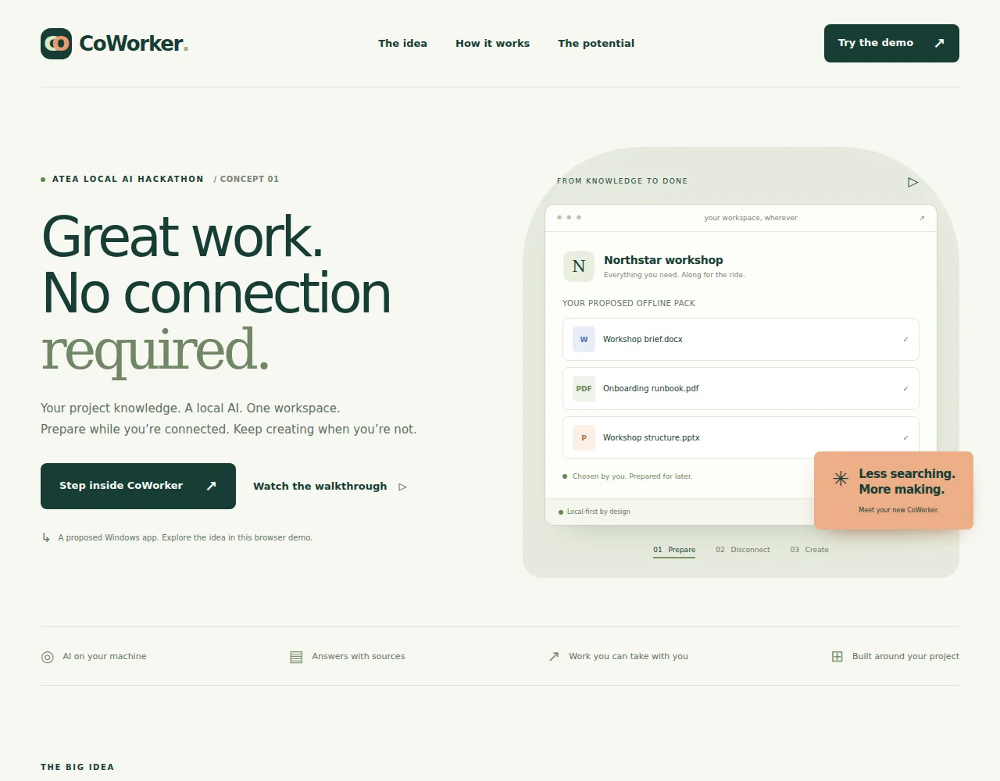
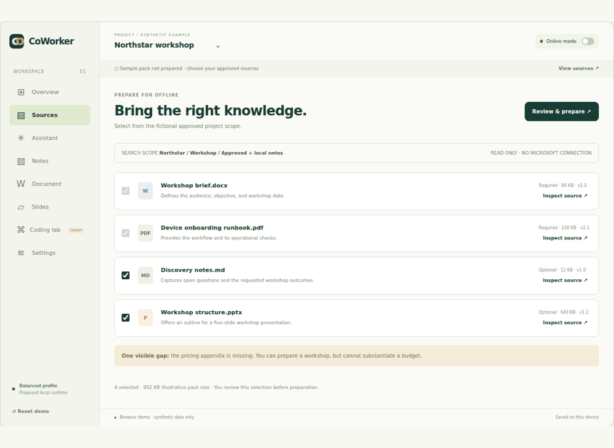
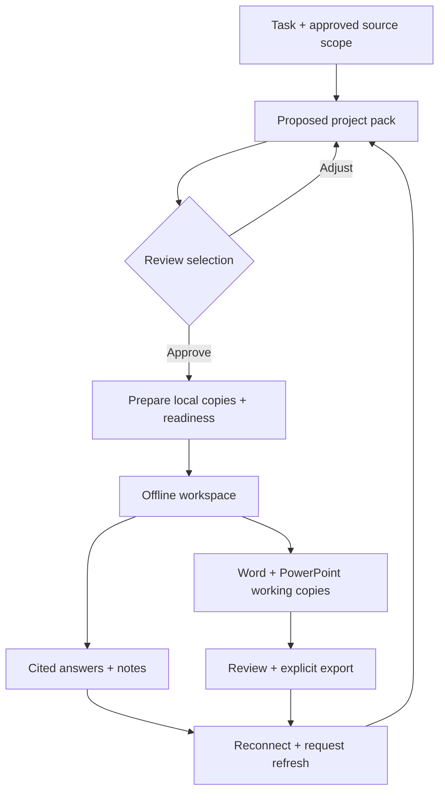

# CoWorker

### Great work. No connection required.

**A local AI workspace concept for the Atea Local AI Hackathon.**

Prepare the right project knowledge while online. Keep asking questions, taking notes, and making documents when the connection disappears.

> **Current phase: concept and interactive website.** This repository does **not** contain the Windows application. The browser demo uses fictional sources and scripted answers. It runs no AI model, connects to no Microsoft tenant, and executes no generated code.

**[Try the demo](https://grubbiy.github.io/AteaCoWorker/)** · **[3-minute presenter guide](docs/demo.md)** · **[What actually works](docs/status.md)** · **[Publishing setup](docs/github-pages.md)**

**Live on GitHub Pages.** The repository remains private; the concept website is public and contains only synthetic data. [Successful deployment](https://github.com/grubbiy/AteaCoWorker/actions/runs/36361826737).



### See the workspace in action



These are captures of the working browser demo, using synthetic data and scripted content.

## The idea in 30 seconds

An Atea consultant is travelling to a customer workshop. Before leaving, they select a project brief, local files, and approved SharePoint folders. CoWorker proposes relevant supporting documents and explains the selection. The consultant reviews and approves a bounded **offline project pack**.

On the train, without an internet connection, the proposed local app helps them find answers with sources, make notes, draft a Word plan, and prepare an editable PowerPoint deck. When they reconnect, they explicitly refresh source snapshots. Their original files remain untouched.

**The differentiator is preparation:** an inspectable project knowledge pack coupled with useful offline work.



## Explore the demo

The website has an animated explanation, a six-step guided tour, and a responsive workspace. No installation or account is required to try the published site.

| Surface | What a tester can do |
| --- | --- |
| Sources | Inspect fictional documents, select optional sources, approve a pack, watch preparation, cancel, and see the missing pricing appendix. |
| Offline Lock | Block preparation, refresh, and simulated coding-network grants while continuing to use the sample project. |
| Assistant | Ask supported sample questions, inspect exact fixture passages, and see an honest refusal to invent a budget. |
| Notes | Type, persist notes in this browser, and download Markdown. |
| Document | Create and edit a sample plan, review a proposed opening, apply it, undo, and download Markdown. |
| Slides | Approve a five-slide outline, edit titles/body text, navigate slides, and download a Markdown storyboard. |
| Coding lab | Inspect a one-file diff, approve or undo the sample change, and explore one-task internet approval. Nothing executes. |
| Settings | Try Light, Balanced, and Performance profiles; adjust context, CPU budget, and battery preference. These are illustrative settings. |
| Refresh | Reconnect, review a sample date change, refresh sources, and preserve existing drafts. |
| Business value | Adjust seat count, potentially removable seats, assumed cost, and annual support expense. See transparent net arithmetic. |

All fixtures describe **Northstar**, a fictional customer. Do not put company information into this demonstration. Browser storage is unencrypted; Reset demo clears notes, drafts, preferences, and progress. The site has no application backend, analytics, external fonts, or external AI calls. The hosting provider still receives ordinary site requests.

The site caches its static assets in supporting browsers. Once “Demo assets cached” appears, it can be reopened offline in that browser. This is website caching, not proof of the desktop app's offline or security guarantees.

## Product ambition

**A useful subset of paid cloud-assistant work, performed locally.** CoWorker could reduce paid-seat demand for employees whose tasks fit project Q&A, drafting, and document preparation. It does not replace Microsoft 365, its source permissions, or all of Copilot.

- **Adapt to the device.** Smaller local models and bounded context for modest hardware; larger verified configurations for capable machines. Actual requirements, quality, and latency must be measured.
- **Stay inspectable.** Scope, source versions, evidence gaps, readiness, edits, and exports stay visible.
- **Keep AI local.** The desktop design has no silent cloud inference fallback. Online source preparation and separately approved internet tasks are different capabilities.
- **Explore coding carefully.** The latest brief adds a separate coding workspace with OS-enforced isolation, resource limits, reviewable patches, and purpose-bound network grants. This is an optional extension, not a security claim or an unrestricted computer-control assistant.

Savings are a **hypothesis**. The website's default numbers are editable examples in NOK, not current Microsoft prices, a procurement recommendation, or demonstrated Atea savings. Reducing Copilot task usage alone does not save licence fees; paid seats must actually be removable. Rollout, hardware, support, and evaluation costs matter.

## Run locally

Node.js 22 or newer is sufficient for the site and unit tests. There are no runtime dependencies or build step.

```sh
npm run dev
```

Open **http://127.0.0.1:4173/AteaCoWorker/**. Do not double-click the HTML file: ES modules and service workers require a web server.

```sh
npm test
```

For the automated browser journey, in a separate terminal while the server runs:

```sh
npm ci
npx playwright install chromium
npm run test:browser
```

Browser tests save evidence under the ignored `artifacts/` directory. Linux may need the browser's system packages; see Playwright's official installation documentation if it reports missing dependencies.

## Repository map

| Path | Purpose |
| --- | --- |
| `site/` | Only the files published to the demo website. |
| `docs/demo.md` | Presenter script and tester walkthrough. |
| `docs/concept.md` | Concise concept, boundaries, and proposed coding isolation. |
| `docs/decisions.md` | Why this phase is a demo and how the latest brief affects the original specification. |
| `docs/status.md` | Executed checks, evidence, and known limitations. |
| `docs/github-pages.md` | Exact publishing steps and private-repository considerations. |
| `specification/` | All five original supplied files, preserved unchanged for future implementation. |
| `tests/` | State, citations, arithmetic, static assets, and browser journey checks. |
| `scripts/serve.mjs` | Small local-only static server. |
| `.github/workflows/checks.yml` | Validate source changes on main and pull requests. |
| `gh-pages` branch | Published snapshot containing only the website assets at its root. |

## Before building the actual application

Use the preserved specification as the starting point, and explicitly resolve its conflict with the proposed coding-agent extension. The original P0 intentionally prohibited runtime shell/code execution. That protection must not be removed from the document assistant just to add a coding tab.

The future Windows app still needs actual local inference, encrypted project persistence, Microsoft delegated permissions and source discovery, real `.docx`/`.pptx` output, hardware benchmarks, isolated code execution, and security validation. None of its AT01–AT15 acceptance gates is passed by a browser mock.

Concept by **Vegard** for the **Atea Local AI Hackathon**. This is not an official Atea product or a Microsoft integration endorsement. No official brand assets were supplied or copied.
